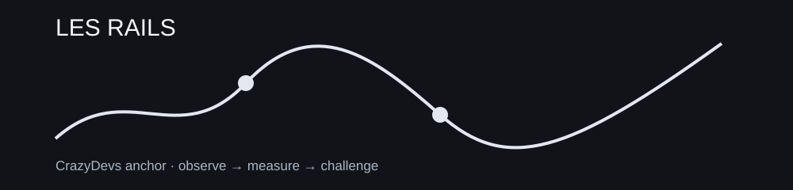

> **SCÈNE CRAZYDEVS — LES RAILS :** Avant de choisir un train, regarde les rails.

# 00 — SOCLE : PORTE D'ENTRÉE + FONDATIONS



Le socle est volontairement plus large que le « core trading » : il apprend aussi à **apprendre le trading**.

## Portes

| Dossier | Rôle |
|---|---|
| [00-GUIDE](00-GUIDE/README.md) | zéro → première séance → navigation |
| [01 — CORE TRADING](01-la-realite-du-trading.md) | réalité du trading et mécanique initiale |
| [02 — PROLOGUE](02-PROLOGUE/README.md) | règles, carte, façon de travailler |
| [03 — REFERENTIEL](03-REFERENTIEL/README.md) | diagnostic + glossaire + compétences |
| [04 — FUNDAMENTALS](04-FUNDAMENTALS/README.md) | maths, risque, ordres, instruments |
| [05 — PROBLEM-SOLVING](05-PROBLEM-SOLVING/README.md) | hypothèse, données, expérimentation |
| [06 — MINDSET](06-MINDSET/README.md) | pratique délibérée + révision |

## Fil canonique du socle

```text
00-GUIDE
   ↓
PROLOGUE
   ↓
REFERENTIEL
   ↓
FUNDAMENTALS
   ↓
PROBLEM-SOLVING
   ↓
CORE TRADING
   ↓
CHALLENGE
   ↓
BOSS
```

## Tu es déjà expérimenté ?

Passe le diagnostic du [REFERENTIEL](03-REFERENTIEL/README.md). Tu peux sauter ce que tu sais **prouver**, pas ce que tu reconnais vaguement.

## Ensuite

Rejoins le [01-CADRAGE](../01-CADRAGE/README.md).
