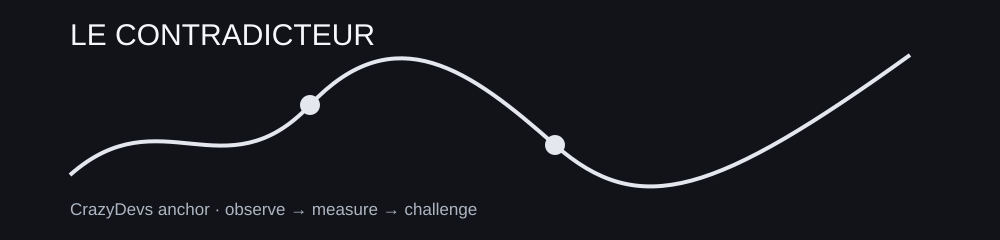

> **SCÈNE CRAZYDEVS : LE CONTRADICTEUR :** Le premier graphique raconte une histoire. Le deuxième montre le contre-exemple.

# 01 : CADRAGE

**Mission :** Transformer une impression en question testable et instrumenter la décision.



## Fil logique

```text
prix, signal, analyse critique, hypothèse, psychologie et journal
```

## Projet fil rouge

[50-MINI-PROJET.md](50-MINI-PROJET.md)

## Fil canonique

```text
PREREQUIS
   ↓
LEÇONS
   ↓
PRATIQUE
   ↓
GRIMOIRE
   ↓
CHALLENGE
   ↓
BOSS-FIGHT
   ↓
PORTAGE
   ↓
PONT
```

## Modules approfondis

- [FONDAMENTAUX MACRO ET DÉCLENCHEURS](06-fondamentaux-macro/README.md)
- [RÉGIMES DE MARCHÉ](07-regimes/README.md)
- [FAMILLES DE STRATÉGIES](08-familles-de-strategies/README.md)
- [HORIZONS & TIMEFRAMES](09-timeframes/README.md)

## Leçons

- [01 : 01-prix-vs-signal](01-prix-vs-signal.md)
- [03 : 02-analyse-technique-sous-critique](02-analyse-technique-sous-critique.md)
- [05 : 03-formuler-une-hypothese](03-formuler-une-hypothese.md)
- [08 : 04-psychologie-observable](04-psychologie-observable.md)
- [10 : 05-journal-decisionnel](05-journal-decisionnel.md)

## NEXT ACTION

Ouvre `00-PREREQUIS.md`, puis la première leçon. Ne parcours pas tout le dépôt en vrac.
