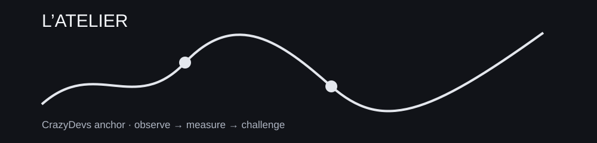

> **SCÈNE CRAZYDEVS : L’ATELIER :** Une idée brillante n’est pas encore une lame : il faut la forger puis la casser.

# 02 : CONSTRUCTION

**Mission :** Transformer une idée en système reproductible, testable et économiquement réaliste.



## Fil logique

```text
stratégie, backtest, biais, sizing, coûts et capacité
```

## Projet fil rouge

[50-MINI-PROJET.md](50-MINI-PROJET.md)

## Fil canonique

```text
PREREQUIS
   ↓
LEÇONS
   ↓
PRATIQUE
   ↓
GRIMOIRE
   ↓
CHALLENGE
   ↓
BOSS-FIGHT
   ↓
PORTAGE
   ↓
PONT
```

## Modules approfondis

- [DATA ENGINEERING](06-data-engineering/README.md)
- [VALIDATION STATISTIQUE](07-validation-statistique/README.md)
- [FEATURE ENGINEERING](08-feature-design/README.md)
- [MODEL RISK](09-model-risk/README.md)

## Laboratoire exécutable

[LAB PYTHON : calculs reproductibles](10-lab-executable/README.md)

## Leçons

- [01 : 04-risque-et-sizing](04-risque-et-sizing.md)
- [02 : 03-biais-de-validation](03-biais-de-validation.md)
- [04 : 05-couts-et-capacite](05-couts-et-capacite.md)
- [06 : 01-strategy-engineering](01-strategy-engineering.md)
- [10 : 02-backtest-reproductible](02-backtest-reproductible.md)

## NEXT ACTION

Ouvre `00-PREREQUIS.md`, puis la première leçon. Ne parcours pas tout le dépôt en vrac.
