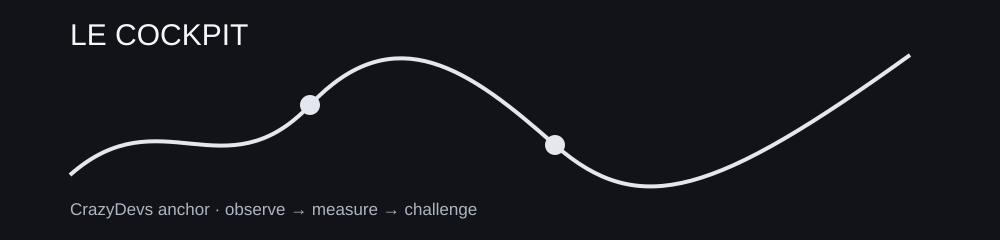

> **SCÈNE CRAZYDEVS — LE COCKPIT :** Un cockpit sérieux surveille aussi les alarmes et les procédures de sortie.

# 03 — PILOTAGE

**Mission :** Faire survivre le système au niveau portefeuille et exploitation.



## Fil logique

```text
portefeuille, stress, exécution, régimes, données et contrôles
```

## Projet fil rouge

[50-MINI-PROJET.md](50-MINI-PROJET.md)

## Fil canonique

```text
PREREQUIS
   ↓
LEÇONS
   ↓
PRATIQUE
   ↓
GRIMOIRE
   ↓
CHALLENGE
   ↓
BOSS-FIGHT
   ↓
PORTAGE
   ↓
PONT
```


## Modules approfondis

- [DÉRIVÉS & GESTION DES PAYOFFS](06-derives-et-greques/README.md)
- [CONSTRUCTION DE PORTEFEUILLE](07-portfolio-construction/README.md)
- [OPÉRATIONS & COMPLIANCE](08-operations-et-compliance/README.md)
- [RUNBOOKS & MONITORING](09-runbooks/README.md)

## Leçons

- [01 — 02-stress-testing](02-stress-testing.md)
- [02 — 03-execution-system](03-execution-system.md)
- [04 — 01-portfolio-risk](01-portfolio-risk.md)
- [06 — 05-data-and-controls](05-data-and-controls.md)
- [08 — 04-regimes-and-drift](04-regimes-and-drift.md)

## NEXT ACTION

Ouvre `00-PREREQUIS.md`, puis la première leçon. Ne parcours pas tout le dépôt en vrac.
