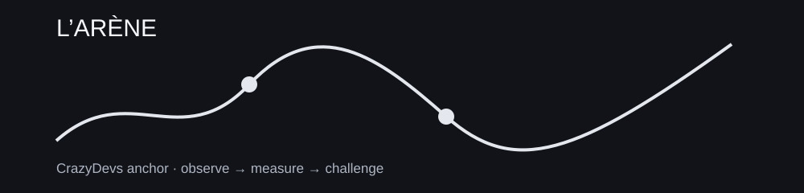

> **SCÈNE CRAZYDEVS — L’ARÈNE :** L’épreuve commence quand quelqu’un change les conditions.

# 04 — ÉPREUVE

**Mission :** Attaquer le système jusqu’à faire apparaître ses limites.



## Fil logique

```text
validation avancée, quant, données adversariales, incidents et postmortem
```

## Projet fil rouge

[50-MINI-PROJET.md](50-MINI-PROJET.md)

## Fil canonique

```text
PREREQUIS
   ↓
LEÇONS
   ↓
PRATIQUE
   ↓
GRIMOIRE
   ↓
CHALLENGE
   ↓
BOSS-FIGHT
   ↓
PORTAGE
   ↓
PONT
```


## Modules approfondis

- [REPLICATION LAB](06-replication-lab/README.md)
- [BACKTEST VS TERRAIN](07-live-vs-backtest/README.md)
- [RED TEAM RESEARCH](08-red-team-research/README.md)

## Leçons

- [02 — 04-incident-operationnel](04-incident-operationnel.md)
- [04 — 02-recherche-quantitative](02-recherche-quantitative.md)
- [06 — 03-adversarial-data](03-adversarial-data.md)
- [07 — 05-postmortem-et-reconstruction](05-postmortem-et-reconstruction.md)
- [09 — 01-validation-avancee](01-validation-avancee.md)

## NEXT ACTION

Ouvre `00-PREREQUIS.md`, puis la première leçon. Ne parcours pas tout le dépôt en vrac.
