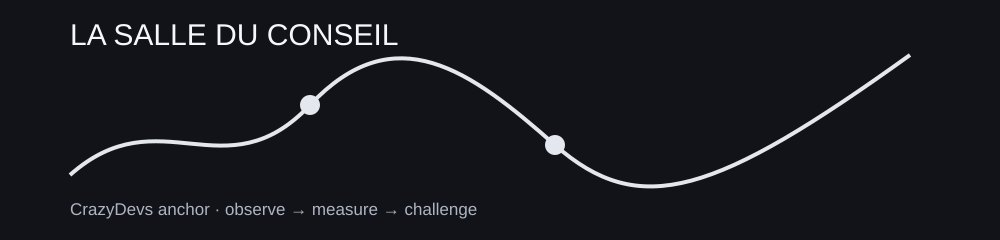

> **SCÈNE CRAZYDEVS — LA SALLE DU CONSEIL :** À ce niveau, tu décides aussi ce qui mérite d’être arrêté.

# 05 — MAÎTRISE

**Mission :** Gouverner la recherche, attribuer la performance et préparer le futur.



## Fil logique

```text
allocation, gouvernance, IA, 2035+ et thèse du praticien
```

## Projet fil rouge

[50-MINI-PROJET.md](50-MINI-PROJET.md)

## Fil canonique

```text
PREREQUIS
   ↓
LEÇONS
   ↓
PRATIQUE
   ↓
GRIMOIRE
   ↓
CHALLENGE
   ↓
BOSS-FIGHT
   ↓
PORTAGE
   ↓
PONT
```


## Modules approfondis

- [LIRE LA RECHERCHE](06-lecture-de-recherche/README.md)
- [IA & GOUVERNANCE](07-ia-et-gouvernance/README.md)
- [COMMUNICATION PRATICIEN](08-communication-praticien/README.md)
- [FEUILLE DE ROUTE 2035+](09-feuille-de-route-2035/README.md)

## Leçons

- [03 — 05-thèse-du-praticien](05-thèse-du-praticien.md)
- [04 — 02-research-governance](02-research-governance.md)
- [06 — 04-2035-et-competences-durables](04-2035-et-competences-durables.md)
- [09 — 03-ai-pour-la-recherche](03-ai-pour-la-recherche.md)
- [10 — 01-allocation-et-performance](01-allocation-et-performance.md)

## NEXT ACTION

Ouvre `00-PREREQUIS.md`, puis la première leçon. Ne parcours pas tout le dépôt en vrac.
