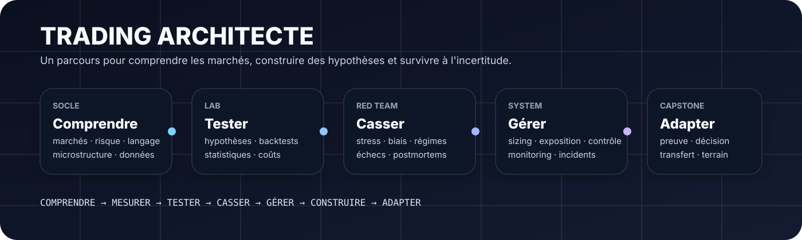
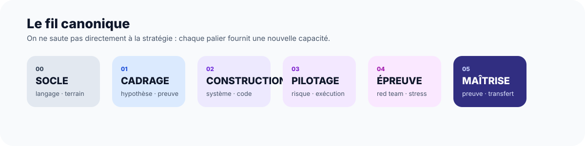
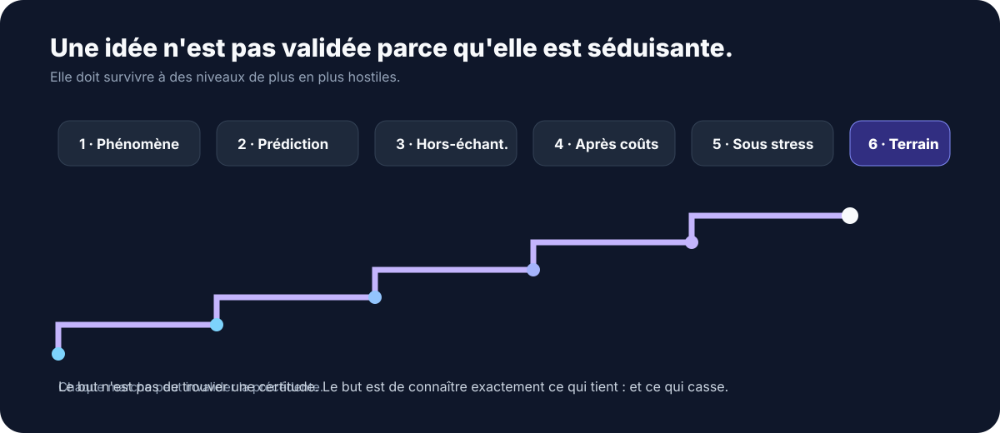

<div align="center">



# TRADING ARCHITECTE

### Comprendre. Mesurer. Tester. Casser. Gérer. Construire. Adapter.

**Un curriculum de trading orienté terrain pour apprendre à raisonner sous incertitude — du zéro-prérequis jusqu'à la construction, la validation et la défense d'un système.**

[**Commencer par le guide**](00-SOCLE/00-GUIDE/README.md) · [**Voir la progression**](PROGRESSION.md) · [**Installer l'environnement**](SETUP.md)

</div>

---

## Pourquoi ce dépôt existe

Le trading grand public pousse souvent à chercher le **setup**, l'indicateur ou le taux de réussite idéal. Trading Architecte part d'une autre question :

> **Que dois-tu comprendre, mesurer, tester et contrôler pour qu'une décision reste défendable lorsque le marché, les données ou tes propres hypothèses deviennent hostiles ?**

Le parcours traite le trading comme un problème d'**architecture de décision** : marché → information → hypothèse → stratégie → exécution → risque → validation → surveillance → révision.

Pas de promesse de revenu. Pas de « stratégie secrète ». Pas de certification par lecture seule.

---

## ✦ Commence ici — même si tu ne connais rien

Tu n'as pas besoin de connaître les marchés, Python ou les statistiques pour franchir la première porte.

**[→ `00-SOCLE/00-GUIDE` — START HERE](00-SOCLE/00-GUIDE/README.md)**

Le guide transversal répond aux questions que les cours avancés oublient souvent :

- Qu'est-ce qu'un marché, un ordre, une position, un spread, un levier ?
- Quelle différence entre investir, spéculer, couvrir et arbitrer ?
- Comment lire une première bougie sans inventer une histoire ?
- Pourquoi un stop-loss ne garantit pas une perte fixe ?
- Comment pratiquer sans risquer son argent ?
- Comment savoir si je dois continuer, revenir en arrière ou changer de piste ?
- Quel vocabulaire dois-je réellement maîtriser avant de passer au code ?

Le dépôt utilise volontairement un **double canal** :

```text
TERME TECHNIQUE
      ↓
explication simple (ce que cela veut dire)
      ↓
analogie (à quoi cela ressemble)
      ↓
mécanisme (ce qui se passe réellement)
      ↓
expérience (ce que tu observes)
      ↓
preuve (ce que tu peux défendre)
```

---

## Une route, pas une bibliothèque à parcourir au hasard



```text
00 SOCLE
   ↓
01 CADRAGE
   ↓
02 CONSTRUCTION
   ↓
03 PILOTAGE
   ↓
04 ÉPREUVE
   ↓
05 MAÎTRISE
```

Chaque niveau ajoute une capacité qui doit devenir **observable**.

| Niveau | Question centrale | Ce que tu construis |
|---|---|---|
| **00 — Socle** | De quoi parle-t-on ? | vocabulaire, marché, risque, données, premières expériences |
| **01 — Cadrage** | Quelle est mon hypothèse ? | problème, hypothèse falsifiable, protocole, preuves |
| **02 — Construction** | Comment rendre l'idée testable ? | stratégies, code, backtests, données, validation |
| **03 — Pilotage** | Comment survivre à l'exécution ? | sizing, exposition, coûts, opérations, monitoring |
| **04 — Épreuve** | Que se passe-t-il quand tout se dégrade ? | stress tests, red team, ruptures de régime, postmortems |
| **05 — Maîtrise** | Puis-je défendre et transférer mon système ? | capstone, réplication, gouvernance, adaptation, soutenance |

---

## Le principe dur



Une idée ne devient pas solide parce qu'elle est populaire, élégante ou rentable sur une jolie courbe.

```text
PHÉNOMÈNE
   ↓
POUVOIR PRÉDICTIF
   ↓
HORS ÉCHANTILLON
   ↓
APRÈS COÛTS
   ↓
SOUS STRESS
   ↓
EN TERRAIN
```

La philosophie est simple : **une affirmation doit gagner progressivement le droit d'être crue**.

C'est pourquoi le parcours traite explicitement le data snooping, l'overfitting, les coûts de transaction, la non-stationnarité, la liquidité, le risque opérationnel et les biais comportementaux.

---

## Ce que tu vas réellement apprendre

### Comprendre le marché

Microstructure, découverte des prix, carnet d'ordres, matching, liquidité, acteurs, instruments, dérivés, coûts et mécanique d'exécution.

### Penser en probabilités

Rendements, distributions, espérance, variance, drawdown, corrélation, risque de ruine, sizing, scénarios et incertitude de modèle.

### Construire une hypothèse

Partir d'un mécanisme économique plutôt que d'un motif graphique, écrire une prédiction falsifiable et définir à l'avance ce qui ferait échouer l'idée.

### Tester sans se raconter d'histoires

Backtesting, hors-échantillon, walk-forward, tests multiples, data snooping, robustesse, coûts, slippage, biais de sélection et validation adversariale.

### Passer du graphique au système

Transformer une intuition en règles explicites, données reproductibles, code testable, métriques et procédures d'exécution.

### Gérer le vrai risque

Levier, exposition, corrélations cachées, gap, liquidité, contrepartie, modèle, opérations, kill switch, monitoring et incidents.

### Comprendre le facteur humain

Loss aversion, overconfidence, disposition effect, FOMO, revenge trading, pression cognitive et architecture de process.

### Lire l'horizon 2035+

Automatisation, IA, agents, données alternatives, exécution algorithmique, gouvernance, résilience et compétences durables — en séparant soigneusement le fait, la tendance, le scénario plausible et la spéculation.

---

## La signature pédagogique

Trading Architecte n'est pas organisé comme une suite de chapitres à mémoriser. Chaque concept important suit autant que possible cette boucle :

```text
EXPLIQUER
   ↓
OBSERVER
   ↓
FAIRE
   ↓
MESURER
   ↓
CASSER
   ↓
EXPLIQUER CE QUI A CASSÉ
   ↓
RÉVISER
```

Tu trouveras donc des **expériences**, des **mini-projets**, des **challenges**, des **Boss**, des **postmortems**, des **ponts de transfert** et un **grimoire** de référence.

Une lecture peut t'apprendre un mot. Une épreuve doit te montrer que tu sais l'utiliser.

---

## Pour les débutants absolus

Le dépôt ne suppose pas que « trader » signifie déjà quelque chose pour toi.

On peut commencer avec :

```text
Je ne connais pas les marchés.
        ↓
Je comprends ce qu'est un actif.
        ↓
Je comprends ce qu'est un ordre.
        ↓
Je comprends pourquoi un prix bouge.
        ↓
Je comprends ce que je risque.
        ↓
Je peux observer sans engager de capital.
        ↓
Je peux formuler une première hypothèse.
        ↓
Je peux la tester.
```

Le jargon est accompagné d'explications en langage simple et d'analogies lorsque cela améliore réellement la compréhension. Le but n'est pas de supprimer la technicité : **c'est de rendre la technicité franchissable**.

---

## Ce que ce dépôt refuse

```text
SETUP MAGIQUE             → non
PROMESSE DE RENDEMENT     → non
CERTIFICATION PAR LECTURE → non
GRAPHIQUE = PREUVE        → non
BACKTEST = FUTUR          → non
IA = ORACLE               → non
```

Une idée populaire peut être étudiée. Elle peut être conservée comme objet historique ou falsifiable. Mais sa popularité ne remplace jamais l'évidence.

---

## Les marchés sont traités comme des systèmes réels

Le cursus ne s'arrête pas à « entrée / sortie ».

```text
INFORMATION
    ↓
HYPOTHÈSE
    ↓
DÉCISION
    ↓
ORDRE
    ↓
ROUTAGE
    ↓
CARNET / VENUE
    ↓
MATCHING
    ↓
EXÉCUTION
    ↓
POSITION
    ↓
RISQUE
    ↓
SURVEILLANCE
    ↓
POSTMORTEM
```

Cela oblige à penser aux choses qui disparaissent souvent dans les formations superficielles : données imparfaites, friction, latence, liquidité, coûts, contrepartie, procédures, erreurs humaines et changement de régime.

---

## Le côté « CrazyDevs »

Les ASCII, schémas et scènes ne sont pas là pour faire joli. Ils servent à faire **voir une architecture mentale**.

```text
AVANT
« Je crois que ça monte. »

        ↓

ARCHITECTE
« Quelle hypothèse ?
 Quelle donnée ?
 Quel mécanisme ?
 Quel test ?
 Quel niveau d'échec ?
 Quel risque si j'ai tort ? »
```

Les illustrations visuelles servent de mémoire ; les expériences et les preuves servent de validation.

---

## Un parcours moderne sans dépendance à la mode

Le curriculum accepte les outils contemporains, mais il privilégie les compétences qui traversent les changements de stack :

**microstructure · pensée probabiliste · risque · qualité des données · validation · ingénierie · observabilité · gouvernance · adaptation**

Les outils peuvent changer. Les contraintes physiques et méthodologiques du marché changent beaucoup moins vite.

---

## Et l'IA ?

L'IA est traitée comme **un outil parmi d'autres, avec des limites et un coût d'erreur**.

Elle peut aider à coder, explorer, documenter ou comparer. Elle peut aussi halluciner, sur-ajuster, amplifier un biais ou masquer une hypothèse fragile.

La règle reste donc :

```text
IA
 ↓
PROPOSITION
 ↓
VÉRIFICATION
 ↓
TEST
 ↓
MESURE
 ↓
DÉCISION
```

Le programme ne dépend pas d'un modèle particulier et n'est pas construit autour d'une promesse d'automatisation totale.

---

## Ce que tu produis en avançant

À différents paliers, tu construis progressivement :

- une carte du marché et des risques ;
- un vocabulaire opérationnel ;
- des observations reproductibles ;
- des hypothèses falsifiables ;
- des stratégies formalisées ;
- des jeux de données contrôlés ;
- des notebooks / scripts et backtests ;
- des rapports de validation ;
- des règles de sizing et de contrôle ;
- des tests de stress ;
- des journaux et postmortems ;
- des systèmes monitorables ;
- un capstone défendable et transférable.

Le résultat final n'est pas « je connais beaucoup de termes ».

> **Le résultat final est : je peux expliquer ce que j'ai construit, pourquoi je lui fais confiance, où il peut casser, et ce que je ferai lorsqu'il cassera.**

---

## Navigation recommandée

### 🟦 Tu débutes totalement

[**00-SOCLE/00-GUIDE — START HERE**](00-SOCLE/00-GUIDE/README.md)

Puis suis le fil canonique sans sauter les prérequis.

### 🟪 Tu connais déjà les bases

Commence par le [**référentiel**](00-SOCLE/03-REFERENTIEL/README.md), identifie tes lacunes, puis reprends au premier palier non validé.

### 🟥 Tu veux surtout pratiquer

Va vers les expériences et mini-projets après avoir vérifié leurs prérequis. Le dépôt privilégie la pratique reproductible à la consommation passive.

### ⬛ Tu veux aller vers le quant / systématique

Le parcours t'y conduit progressivement : données → hypothèse → stratégie → validation → exécution → risque → stress → gouvernance.

---

## Structure du dépôt

```text
TRADING-ARCHITECTE/
│
├── 00-SOCLE/
│   ├── 00-GUIDE/
│   ├── REFERENTIEL/
│   ├── FUNDAMENTALS/
│   ├── PROBLEM-SOLVING/
│   └── MINDSET/
│
├── 01-CADRAGE/
├── 02-CONSTRUCTION/
├── 03-PILOTAGE/
├── 04-EPREUVE/
├── 05-MAITRISE/
│
├── 06-ANNEXES-TRANSVERSES/
│   └── 00-GUIDE.md
│
├── PROGRESSION.md
├── SETUP.md
└── README.md
```

---

## Règle d'or

```text
NE PAS CHERCHER :
« Quelle stratégie marche ? »

CHERCHER :
« Quelle affirmation puis-je démontrer,
 dans quelles conditions,
 avec quelles limites,
 et que se passe-t-il lorsqu'elle cesse de fonctionner ? »
```

C'est la différence entre **utiliser un outil** et **construire un système que l'on comprend**.

---

<div align="center">

**TRADING ARCHITECTE**

*Pas une promesse de richesse. Une école de raisonnement sous incertitude.*

[**→ Entrer par le Guide**](00-SOCLE/00-GUIDE/README.md)

</div>
